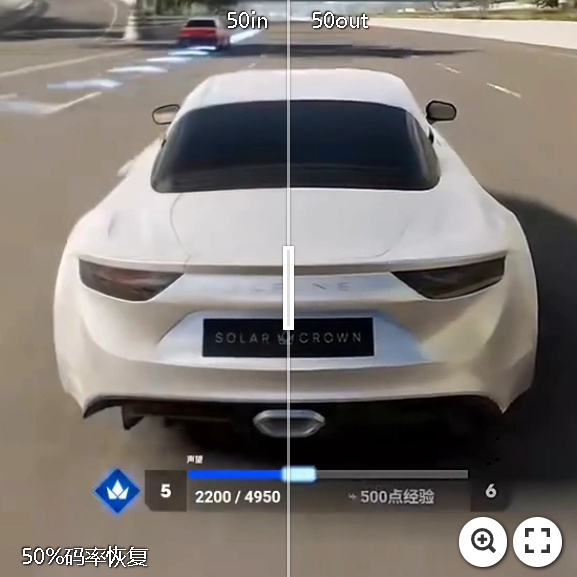
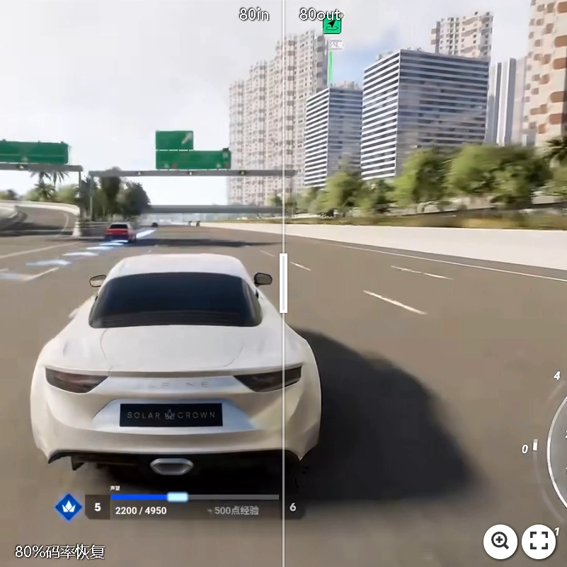
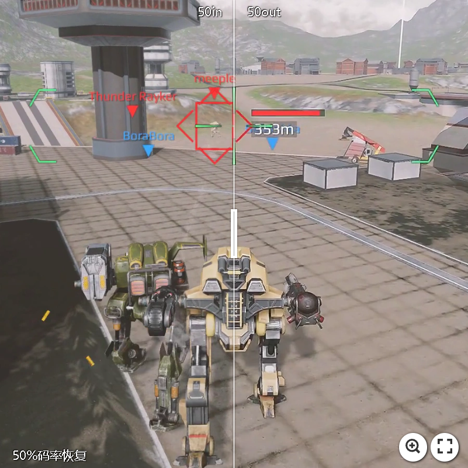
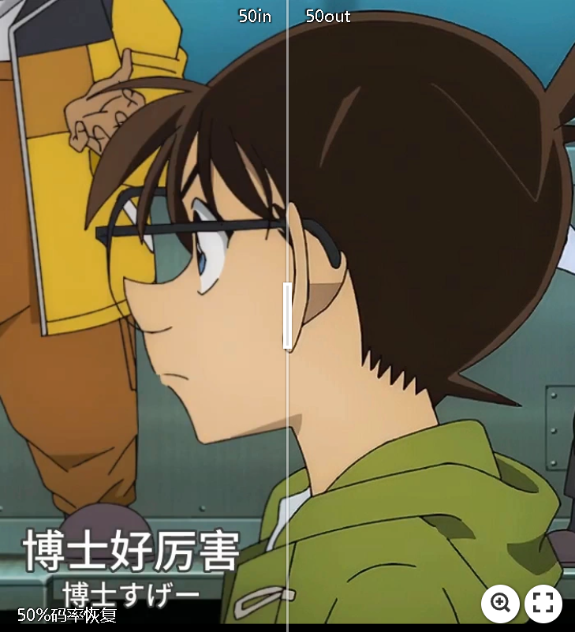
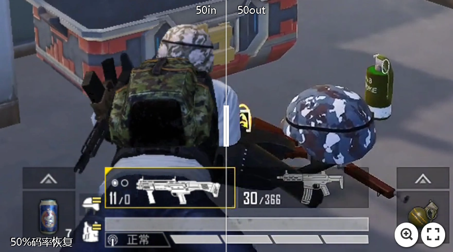
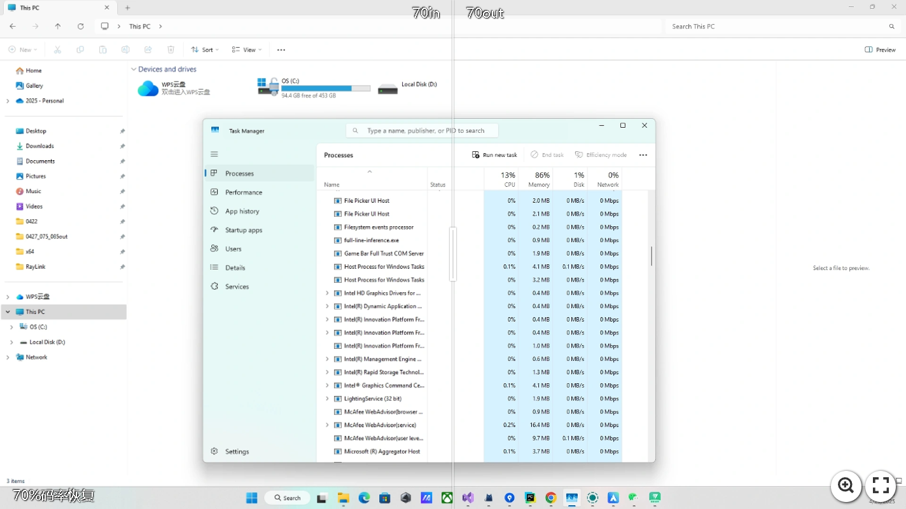
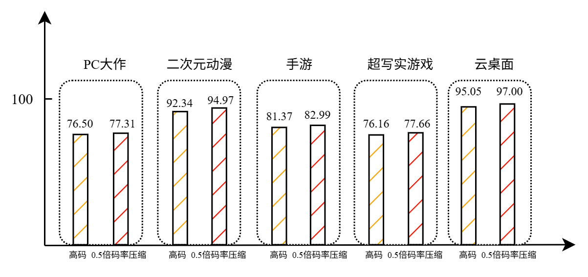

# 端侧实时码率恢复SDK

端侧实时码率恢复SDK (Low-End Device Compatible Bitrate Recovery SDK)是一款由南京冰河物语智能科技有限公司基于GlacierAI边缘计算框架打造的端侧实时视频码率恢复引擎。该SDK旨在帮助视频传输类应用（如直播、点播、云游戏、云桌面等）实现低带宽条件下的超高清视觉效果。

## 产品价值

### 降低带宽成本
- 相较传统技术，带宽成本最低可降低20%-50%。
- 典型案例中，通过SDK码率恢复技术，3Mbps视频可恢复出接近5Mbps编码所呈现的视觉质量，保证相同视觉观感的同时能够节省40%带宽。

## 产品特点

### 高兼容性
- 全平台支持：兼容 Android、iOS、Windows、macOS、Linux 等主流操作系统。
- 适配广泛硬件架构，包括移动端芯片（如天玑、高通、苹果A系列）、PC端主流CPU+GPU组合（如Intel、AMD + NVIDIA）。
- 适合多种形态终端部署：如手机、平板、电视盒子、嵌入式设备、笔记本电脑及云桌面系统。
- 可集成于移动端App、小程序、电视端设备以及PC端云桌面等，灵活满足各种显示终端的使用需求。
- 支持跨平台SDK集成，便于在移动端、桌面端及边缘设备中快速部署落地。

### 高帧率
- 针对不同设备深度优化，确保在低功耗场景下依旧维持高性能表现。
- 低端设备如天玑700，1k分辨率稳定输出60FPS+

### 低延迟
- 基于边缘计算与异步加速架构，端到端延迟低至10ms；
- 可无缝应用于直播、云游戏等高实时性场景。

### 低功耗
- 利用端侧GPU加速与轻量模型推理，同等画质下功耗明显低于行业平均水平；长时间稳定运行不发热。

### 易部署
- 提供解耦式SDK，不影响原生编解码架构，微代码即可快速部署。

### 高度定制化
- 支持客户需求深度定制，满足不同场景的多样化需求。

## 应用场景
- **直播平台**
- **视频点播服务**
- **云游戏传输**
- **云桌面**

## 效果展示
使用端侧实时码率恢复SDK处理的视频流，在视觉质量评价指标（如VMAF）测试中，表现远超传统高码率传输方案，确保用户享受超高清的视频体验。

### 超写实游戏效果对比

  

---

### 端游效果对比

  

---

### 二次元动漫效果对比

  

---

### 手游效果对比

 

---

### 云桌面效果对比

---

### 整体效果评估

通过VMAF智能压缩技术，在保证视觉质量的前提下实现30%-40%的压缩率提升，有效降低存储成本。

## 联系我们

- 联系人：支先生
- 电话：13124714877
- 邮箱：[jeremyzhi@glacier.fit](mailto:jeremyzhi@glacier.fit)
- 地址：
  - 江苏省南京市鼓楼区中央路201号金茂广场1806室
  - 北京市朝阳区星城国际大厦C座1010室