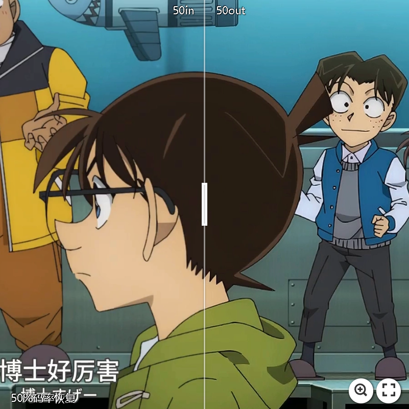
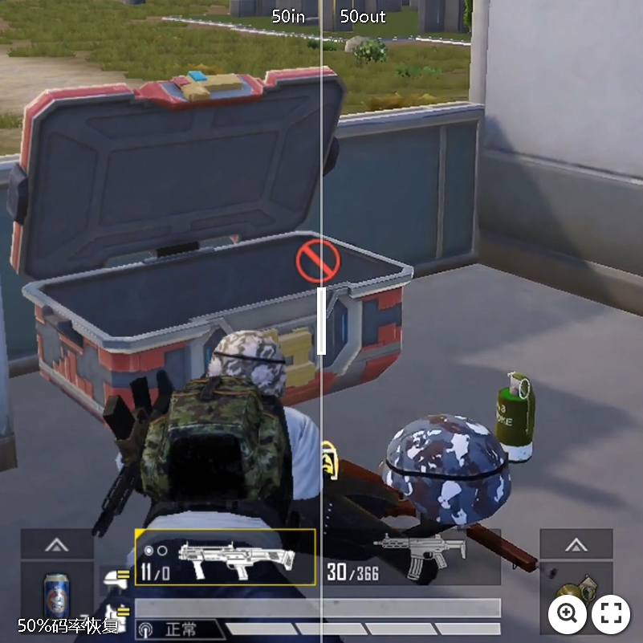

# 端侧实时码率恢复SDK

端侧实时码率恢复SDK (Low-End Device Compatible Bitrate Recovery SDK)是一款由南京冰河物语智能科技有限公司基于GlacierAI边缘计算框架打造的端侧实时视频码率恢复引擎。该SDK旨在帮助视频传输类应用（如直播、点播、云游戏等）实现低带宽条件下的超高清视觉效果。

## 产品特点

### 高兼容性
- 兼容99%的安卓芯片及苹果机型芯片。

### 高帧率
- 低端设备（如骁龙700/820）可稳定运行60FPS以上。
- 中高端设备（如苹果A16）可稳定运行100FPS以上。

### 低延迟
- 延迟低至10ms，确保实时视频流的高效处理。

### 低功耗
- 同等画质下功耗明显低于行业平均水平，长时间稳定运行不发热。

### 易部署
- 提供解耦式SDK，不影响原生编解码架构，微代码即可快速部署。

### 带宽成本优化
- 相较传统技术，带宽成本最低可降低20%-50%。
- 典型案例中，能够实时将6-8Mbps的视频流提升至相当于7.2-9.6Mbps的视频视觉效果。

### 高度定制化
- 支持客户需求深度定制，满足不同场景的多样化需求。

## 应用场景
- **直播平台**
- **视频点播服务**
- **云游戏传输**
- **云桌面**

通过实时提高视频质量，极大降低带宽需求，助力平台有效控制成本，提升用户视觉体验。

## 产品架构
- 支持H.264, H.265, AV1等主流视频编码格式。
- 可集成于移动端App、小程序、Web应用、电视端设备以及PC端云桌面等，灵活满足各种显示终端的使用需求。

## 效果展示
使用冰河物语SDK处理的视频流，在视觉质量评价指标（如VMAF）测试中，表现远超传统高码率传输方案，确保用户享受超高清的视频体验。
## 效果展示

## 效果展示（滑动对比图）

### 超写实游戏效果对比

| 类型 | 50%码率 | 60%码率 | 70%码率 | 80%码率 |
|------|---------|---------|---------|---------|
| 对比 |  |  |  |  |

---

### 端游效果对比

| 类型 | 50%码率 | 60%码率 | 70%码率 | 80%码率 |
|------|---------|---------|---------|---------|
| 对比 |  |  |  |  |

---

### 二次元动漫效果对比

| 类型 | 50%码率 | 60%码率 | 70%码率 | 80%码率 |
|------|---------|---------|---------|---------|
| 对比 |  |  |  |  |

---

### 手游效果对比

| 类型 | 50%码率 | 60%码率 | 70%码率 | 80%码率 |
|------|---------|---------|---------|---------|
| 对比 |  |  |  |  |

---

### 整体效果评估

通过VMAF智能压缩技术，在保证视觉质量的前提下实现30%-40%的压缩率提升，有效降低存储成本。

## 联系我们
- 联系人：支浩宇
- 电话：13124714877
- 邮箱：[jeremyzhi@glacier.fit](mailto:jeremyzhi@glacier.fit)
- 地址：
  - 江苏省南京市鼓楼区中央路201号金茂广场1806室
  - 北京市朝阳区星城国际大厦C座1010室

